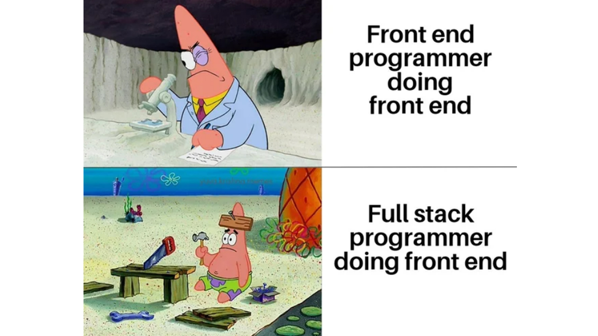
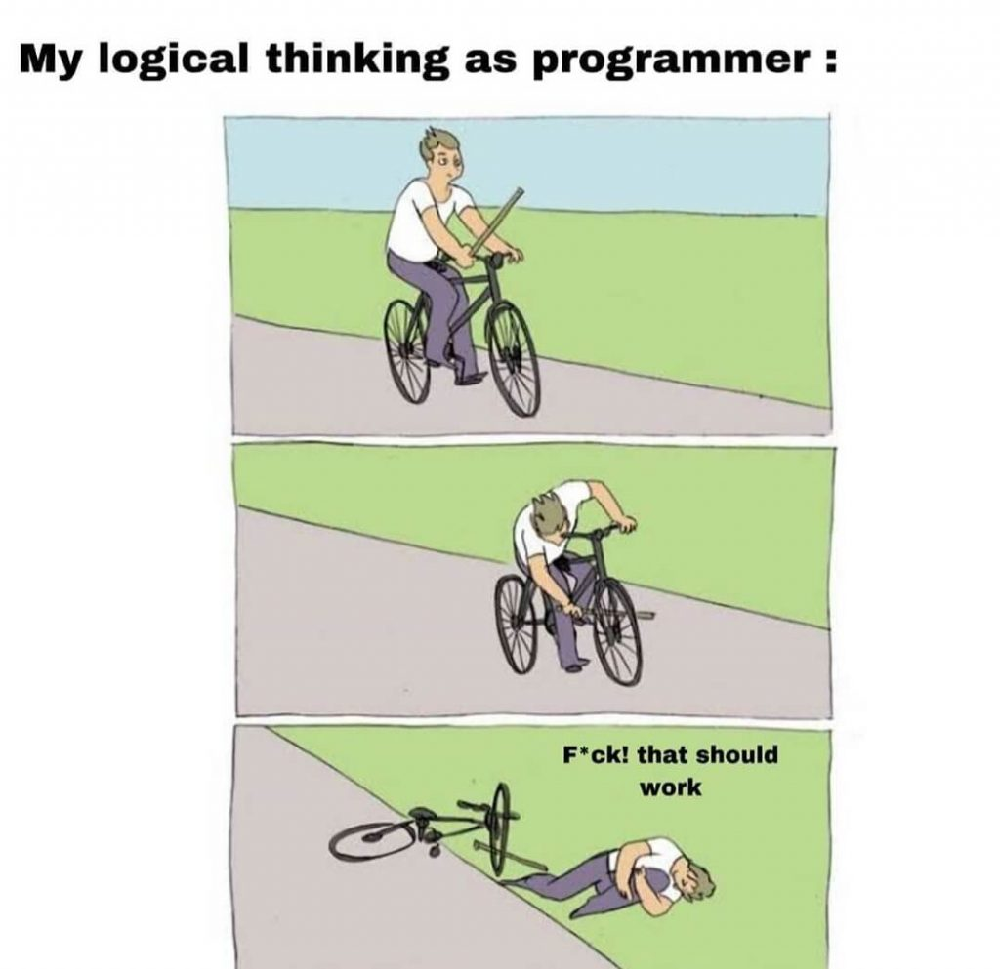
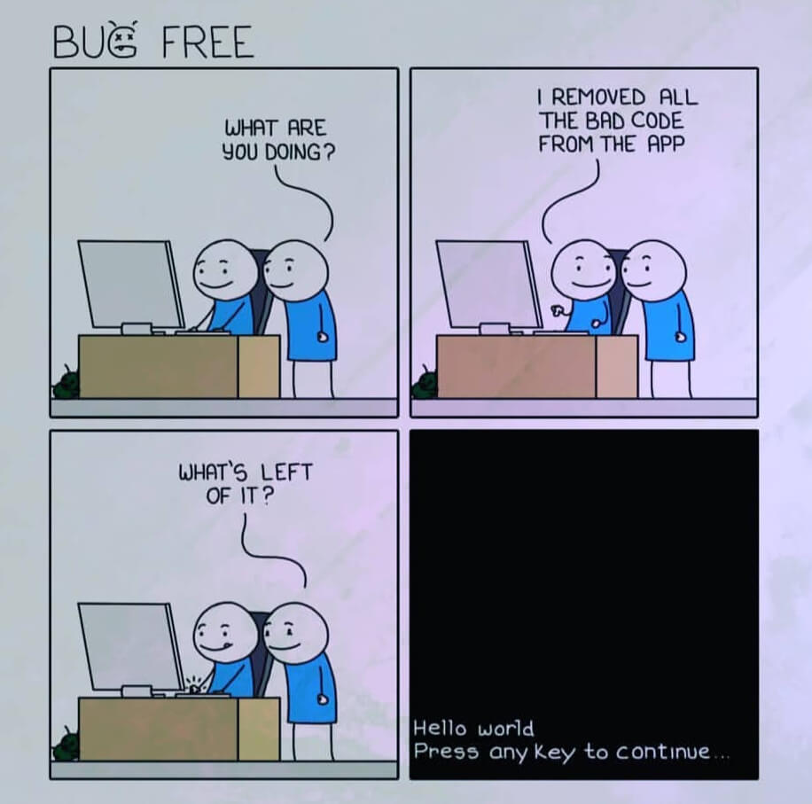

Here is the weekly update of (significant) changes made in Xiphium this week, extracted from Git(Hub).

:::warning
These are interpretations of code read from the weekly changes from Git(Hub) and are therefore prone to errors.
:::

<!--truncate-->

## Cleanup
Several unused Forms, tabs, Objects and Object methods have been removed. This cleans up the directory and forms for a clearer view.

## Clone Series
Changes have been made to 'Button2' in form 'Pla_Dialog_Clones'. When creating a clone series using this button, the delivery note and originType are now added to the new Clone as well. Also, it used to be when creating new CloneCodes without specifying an Origin clone, the new CloneCodes were prefixed with a useless "-". This is now fixed.

## Leisure
Since not many significant changes have been made to Xiphium this week, let's fill this blog with some programming memes

