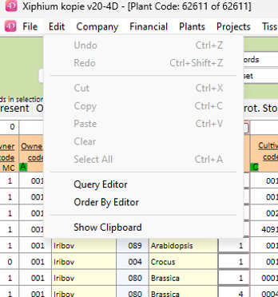

Here is the weekly update of (significant) changes made in Xiphium this week, extracted from Git(Hub).

:::warning
These are interpretations of code read from the weekly changes from Git(Hub) and are therefore prone to errors.
:::

<!--truncate-->
## Leading_zeros
Method ***Leading_zeros*** is added for a better way to add a 0 before a number when needed. The method accepts both text and numbers.

The plan is to slowly replace all the String($var;"000") statements with this new method.

<details>
<summary>example</summary>

Let's say we have company code variable `$comCode` which is a number, and we need to convert it to a string. We know that company codes below 999 need a leading "0".

When using the classic `$comcodeText:=String($comCode;"000")` code, a number (or string) above above 999 would give an invalid value.

Therefore an 'if' statement was needed:
```4D
If($comCode<1000)
	$comCodeText:=String($comCode;"000")
Else
	$comCodeText:=String($comCode)
End If
```

This could be reduced to one line using the Choose function, but that doesn't make it more readable (or performant):
```4D
$comCodeText:=Choose($comCode<1000;String($comCode;"000");String($comCode))
```

Using the new ***Leading_zero*** method, no if statement is needed:
```4D
$comCodeText:=Leading_zeros($comCode;3)
```

</details>

## Interprocess variables
Interprocess variables are now depricated. 4D assures that there's no need to rush replacing interprocess variables, but it is worth noting.

## Experiment Scanning Menu
The experiment scanning menu has received some updates:
- Dynamic observation columns now work correctly
- the 'notes' button now works without errors

## Access
Method ***DB_LockFields*** has been adjusted to also accept pointers to pointer arrays. This makes it possible to create an array of fields that is the minimum everyone can access, and add some fields for certain conditions. This will help the consistency of access for complex cases.

### Analyis_Order Access
The Access to analysis order according to the status of the order and access group of the user has been adjusted to use the new function to pass pointers to pointer arrays.

<details>
<summary>Old vs new Code</summary>

old Code:
```4D
If ($ManagementAS=True:C214) | (Current user:C182="designer")
			DB_LockFields((Old:C35([Analysis_Order:32]AnO_Status:34)="Reported"); ->[Analysis_Order:32]; ->[Analysis_Order:32]AnO_InvoiceNumber:19; ->[Analysis_Order:32]AnO_Status:34; ->[Analysis_Order:32]AnO_Date_Report:93; ->[Analysis_Order:32]AnO_Audit:56; ->[Analysis_Order:32]AnO_Invoice_Extern:68; ->[Analysis_Order:32]AnO_Remarks_Invoice:72; ->[Analysis_Order:32]AnO_Checked:87; ->[Analysis_Order:32]AnO_Article2_Quantity:82; ->[Analysis_Order:32]AnO_Article3_Quantity:83; ->[Analysis_Order:32]AnO_Article4_Quantity:84; ->[Analysis_Order:32]AnO_Article4:76; ->[Analysis_Order:32]AnO_Article4_Description:80; ->[Analysis_Order:32]AnO_Date_Invoice:8; ->[Analysis_Order:32]AnO_ComCode_Cost:54; ->[Analysis_Order:32]AnO_ComName_Cost:55; ->[Analysis_Order:32]AnO_Amount_DataPoints:60)
			DB_LockFields((Old:C35([Analysis_Order:32]AnO_Status:34)="Invoiced"); ->[Analysis_Order:32]; ->[Analysis_Order:32]AnO_InvoiceNumber:19; ->[Analysis_Order:32]AnO_Audit:56; ->[Analysis_Order:32]AnO_Invoice_Extern:68; ->[Analysis_Order:32]AnO_Remarks_Invoice:72; ->[Analysis_Order:32]AnO_Article2_Quantity:82; ->[Analysis_Order:32]AnO_Article3_Quantity:83)
			DB_LockFields((Old:C35([Analysis_Order:32]AnO_Status:34)="Finished"); ->[Analysis_Order:32]; ->[Analysis_Order:32]AnO_InvoiceNumber:19; ->[Analysis_Order:32]AnO_Audit:56; ->[Analysis_Order:32]AnO_Invoice_Extern:68; ->[Analysis_Order:32]AnO_Remarks_Invoice:72)
		Else 
			DB_LockFields((Old:C35([Analysis_Order:32]AnO_Status:34)="Analysed"); ->[Analysis_Order:32]; ->[Analysis_Order:32]AnO_InvoiceNumber:19; ->[Analysis_Order:32]AnO_ComCode_Cost:54; ->[Analysis_Order:32]AnO_ComName_Cost:55; ->[Analysis_Order:32]AnO_Remarks_Invoice:72; ->[Analysis_Order:32]AnO_Audit:56; ->[Analysis_Order:32]AnO_Invoice_Extern:68; ->[Analysis_Order:32]AnO_Amount_DataPoints:60)
			DB_LockFields((Old:C35([Analysis_Order:32]AnO_Status:34)="Reported"); ->[Analysis_Order:32]; ->[Analysis_Order:32]AnO_InvoiceNumber:19; ->[Analysis_Order:32]AnO_Date_Invoice:8; ->[Analysis_Order:32]AnO_Status:34; ->[Analysis_Order:32]AnO_ComCode_Cost:54; ->[Analysis_Order:32]AnO_ComName_Cost:55; ->[Analysis_Order:32]AnO_Remarks_Invoice:72; ->[Analysis_Order:32]AnO_Audit:56; ->[Analysis_Order:32]AnO_Invoice_Extern:68; ->[Analysis_Order:32]AnO_Article4_Quantity:84; ->[Analysis_Order:32]AnO_Article4:76; ->[Analysis_Order:32]AnO_Article4_Description:80; ->[Analysis_Order:32]AnO_Amount_DataPoints:60)
			DB_LockFields((Old:C35([Analysis_Order:32]AnO_Status:34)="Invoiced"); ->[Analysis_Order:32]; ->[Analysis_Order:32]AnO_InvoiceNumber:19; ->[Analysis_Order:32]AnO_Audit:56; ->[Analysis_Order:32]AnO_Invoice_Extern:68; ->[Analysis_Order:32]AnO_Remarks_Invoice:72)
			DB_LockFields((Old:C35([Analysis_Order:32]AnO_Status:34)="Finished"); ->[Analysis_Order:32]; ->[Analysis_Order:32]AnO_InvoiceNumber:19; ->[Analysis_Order:32]AnO_Audit:56; ->[Analysis_Order:32]AnO_Invoice_Extern:68; ->[Analysis_Order:32]AnO_Remarks_Invoice:72)
		End if 
```

new code:
```4D
ARRAY POINTER:C280($base; 0)
		APPEND TO ARRAY:C911($base; ->[Analysis_Order:32]AnO_InvoiceNumber:19)
		APPEND TO ARRAY:C911($base; ->[Analysis_Order:32]AnO_Audit:56)
		APPEND TO ARRAY:C911($base; ->[Analysis_Order:32]AnO_Invoice_Extern:68)
		APPEND TO ARRAY:C911($base; ->[Analysis_Order:32]AnO_Remarks_Invoice:72)
		
		ARRAY POINTER:C280($reported; 0)
		COPY ARRAY:C226($base; $reported)
		APPEND TO ARRAY:C911($reported; ->[Analysis_Order:32]AnO_Status:34)
		APPEND TO ARRAY:C911($reported; ->[Analysis_Order:32]AnO_Article4:76)
		APPEND TO ARRAY:C911($reported; ->[Analysis_Order:32]AnO_Article4_Quantity:84)
		APPEND TO ARRAY:C911($reported; ->[Analysis_Order:32]AnO_Article4_Description:80)
		APPEND TO ARRAY:C911($reported; ->[Analysis_Order:32]AnO_Date_Invoice:8)
		APPEND TO ARRAY:C911($reported; ->[Analysis_Order:32]AnO_ComCode_Cost:54)
		APPEND TO ARRAY:C911($reported; ->[Analysis_Order:32]AnO_ComName_Cost:55)
		APPEND TO ARRAY:C911($reported; ->[Analysis_Order:32]AnO_Amount_DataPoints:60)
		
		If ($ManagementAS=True:C214) | (Current user:C182="designer")
			DB_LockFields((Old:C35([Analysis_Order:32]AnO_Status:34)="Reported"); ->[Analysis_Order:32]; ->$reported; ->[Analysis_Order:32]AnO_Date_Report:93; ->[Analysis_Order:32]AnO_Checked:87; ->[Analysis_Order:32]AnO_Article2_Quantity:82; ->[Analysis_Order:32]AnO_Article3_Quantity:83)
			DB_LockFields((Old:C35([Analysis_Order:32]AnO_Status:34)="Invoiced"); ->[Analysis_Order:32]; ->$base; ->[Analysis_Order:32]AnO_Article2_Quantity:82; ->[Analysis_Order:32]AnO_Article3_Quantity:83)
			
		Else 
			DB_LockFields((Old:C35([Analysis_Order:32]AnO_Status:34)="Analysed"); ->[Analysis_Order:32]; ->$base; ->[Analysis_Order:32]AnO_ComCode_Cost:54; ->[Analysis_Order:32]AnO_ComName_Cost:55; ->[Analysis_Order:32]AnO_Amount_DataPoints:60)
			DB_LockFields((Old:C35([Analysis_Order:32]AnO_Status:34)="Reported"); ->[Analysis_Order:32]; ->$reported)
			DB_LockFields((Old:C35([Analysis_Order:32]AnO_Status:34)="Invoiced"); ->[Analysis_Order:32]; ->$base)
		End if 
		DB_LockFields((Old:C35([Analysis_Order:32]AnO_Status:34)="Finished"); ->[Analysis_Order:32]; ->$base)
```

:::note style choice
In the code above I chose to copy array `$base` into array `$reported`. it is also possible to not do this, and just pass both arrays to the ***DB_LockFields*** method: `DB_LockFields(->$base;->$reported)`. This is a stylistic choice we should come to agreement to.
:::

</details>

## Greenhouse-Field excel export
Method ***GF_ExportExcelReportEstimateQC*** now exports 3 more columns named:
1. Reason not planted machine
2. Reason not sorted machine
3. Remarks sorting

## Order 
### Order Check
Method ***Ord_Check*** has a single change on line 672.

going from:
```4D
$order1:=$order0.query("Ord_EmpName_Planner = :1 and Ord_ComCode_Prod <= :2"; ""; 5)
```
to
```4D
$order1:=$order0.query("Ord_EmpName_Planner = :1 and Ord_ComCode_Prod <= :2"; ""; 4)
```
The significance of this change is unclear to me from just reading this code change.

### Excel Export
Method ***Ord_ExportExcel*** now has an extra option when pressing the 'Control' key while executing the method when default_company=1. This will result in executing the new method ***Ord_PrintDeliverySheetStock*** instead of method ***Ord_PrintDeliverySheet***.

Method ***Ord_PrintDeliverySheetStock*** uses very concise classic 4D commands to create an export. It seems to only export the fields:
- Ord_N_Plant
- Ord_N_Plant_Dell
- Ord_N_Plant_Prog

But I'm not familiar with the commands used, so it might do more.

<details>
<summary>Ord_PrintDeliverySheetStock</summary>

```4D
/ (PM) Ord_PrintDeliverySheet
// Export the Scorelist TCPA items to a Excel document

ORDER BY:C49([Order:12]; [Order:12]Ord_ComCode_Customer:23; [Order:12]Ord_CropCode:85; [Order:12]Ord_PlantCode:1)

If (Records in selection:C76([Order:12])>0)

	Report_PrintDate:=Current date:C33(*)
	Report_PrintTime:=Current time:C178(*)

	// Perform a break on customer and crop code
	BREAK LEVEL:C302(2; 1)
	// Accumulate these values in order to get subtotals
	ACCUMULATE:C303([Order:12]Ord_N_Plant:55; [Order:12]Ord_N_Plant_Del:59; [Order:12]Ord_N_Plant_Prog:58)

	FORM SET OUTPUT:C54([Order:12]; "Ord_PrintDeliverySheetStock")
	_O_PAGE SETUP:C299([Order:12]; "Ord_PrintDeliverySheetStock")
	PRINT SELECTION:C60([Order:12])
	FORM SET OUTPUT:C54([Order:12]; "Ord_List")

End if 
```
</details>

### Update Record
Method ***Ord_UpdateRecord_Validate*** now searches related delivery items with type 'out' and stores the amount of records in field [Order]Ord_Rec_DiT_Out:
```4D
$diT:=ds.Delivery_Items.query("DiT_IDM_Ord = :1"; [Order]Ord_IDM_OrderNumber)
[Order]Ord_Rec_DiT:192:=$diT.length

$diT:=$diT.query("deliveryNote.DeN_Type_InOut = :1"; "Out")
[Order]Ord_Rec_DiT_Out:=$diT.length
```

## Project2
Method ***Pro2_RadioB_Con*** now supports the 'Quotation' and 'Report' checkmarks. This is used to filter Contact records in the detail screen.

Method ***Pro2_SelectForDetail*** now executes the ***Doc_FindDocuments*** method for searching related documents when `$page=14`.

## Project2_Year
Method ***Pro2Y_UpdateRecord*** has had 2 changes:
1. Properly add the '70%' for hours (or different percentage entered in the connected project2).
2. Optimize [Order] ORDA query for better performance.

## Query and Order By editor
Methods ***orderByEditor*** and ***queryEditor*** have been added to open the order by and query editor from any table form. These options are also added the the 'Edit' menu. We probably need to add some protection to these options if we don't want everyone to be able to use them.


## DeliveryNote
The trigger in delivery not has been adjusted. When a deliveryNote is adjusted from any status to status 'shipped', an email is sent.

## Clone
A new button is added that searches for the origin clones of a Clone selection.

## Web stuff
Method ***Web_DeliveriesRefresh*** has a new line: `$item.barcode:=[TC_Reg_Emp]TC2E_Barcode` to return the barcode form the found record.

## Unload Record
Several methods have a 'unload record' added:
- ***DiT_Goto_DeN***
- ***Settings_GetDefaultCompany***
- ***Settings_GetDefaultCompany_Num***
This is probably added to prevent issues with blocking records or something.
