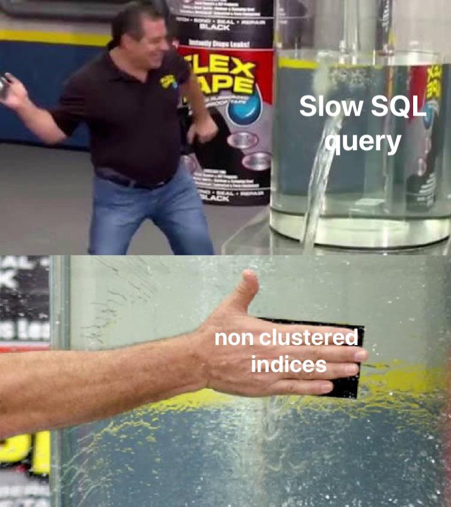

Here is the weekly update of (significant) changes made in Xiphium this week, extracted from Git(Hub).

:::warning
These are interpretations of code read from the weekly changes from Git(Hub) and are therefore prone to errors.
:::

<!--truncate-->

## Crop Week
Method ***CroWe_UpdateRecord_TCPA*** has removed the 'WorkType = 11' of the TCPA query, reverting the change done to it in week 2024-W28.

## Deliveries
Methods ***DeN_ImportItems***, ***Ord_CreateDeliveryNote*** and ***Puit_CreateDeliveryNote*** and buttons 'Ord_Dialog_DiT/Ord_Dialog_InD_Btn_OK', 'Ord_Dialog_DiT_No_DeN/Ord_Dialog_InD_Btn_OK', 'BreCros_Dialog_DiT/Ord_Dialog_InD_Btn_OK' and 'BreGeno_Dialog_DiT/Ord_Dialog_InD_Btn_OK'  have been modified to create an IDMT for newly created [Delivery_Items].

Method ***DiT_UpdateRecord*** has been modified. Changes are hard to interpret with the current diff, but it seems that there is now an initial check if there is an existing related DeliveryNote before updating some of the data.

Method ***DiT_UpdateRecord_Documents*** has been added. This method searches for related documents of the delivery item and updates relevant fields.

## Prices
Button 'PlaPri_List/vScan_Btn_Close5' has been heavily modified to create [Prices] records.

## Experiment Scan menu
Smal bugfix of an error. The error itself had no impact on functionality, but is now resolved.

Button 'Create Experiment' has been improved so creating new experiments inside the scanmenu now works better (untested in production).

Button 'Create Treatment' has been improved to fill in more information automatically.

## HourRegistration
Buttons 'HR_List/vScan_Btn_Close2', 'HR_List/vScan_Btn_Close3' 'HR_List/vScan_Btn_Close4' and 'HR_List/vScan_Btn_Close5' have been added. They seem to be tests of Excel exports and a Filter.

## Web Stuff

Method ***0000_TestRL*** now has methods ***Web_MaintenanceController*** ***Constants_Setup*** and ***Web_DocumentsController*** added to it.

Method ***Web_MaintenanceController*** has been modified. It seems that the method now correctly assigns access to users based on an api key.

Method ***Web_MaintenanceGetDocument*** has been added. It seems that this method adds functionality to the maintenance app for getting documents.

Method ***Web_MaintenanceGetEquipment*** has been modified. Dates are now stored in ISO format using the new ***DateTime_ToISODate*** method. A document URL is now added to the reply (if related documents exist).

Method ***Web_MaintenanceSaveMaintenance*** has been modified to convert the ISO dates back to 'regular' 4D dates.

## Misc
- Bugfix of method ***DateTime_GetMonthName***, making the method actually work.
- Method ***DateTime_ToISODate*** has been added.

## Meme of the week
Here is the programming meme of this week:
Meme of the week is NOT a recurrent theme and is only instantiated whenever I feel like it.