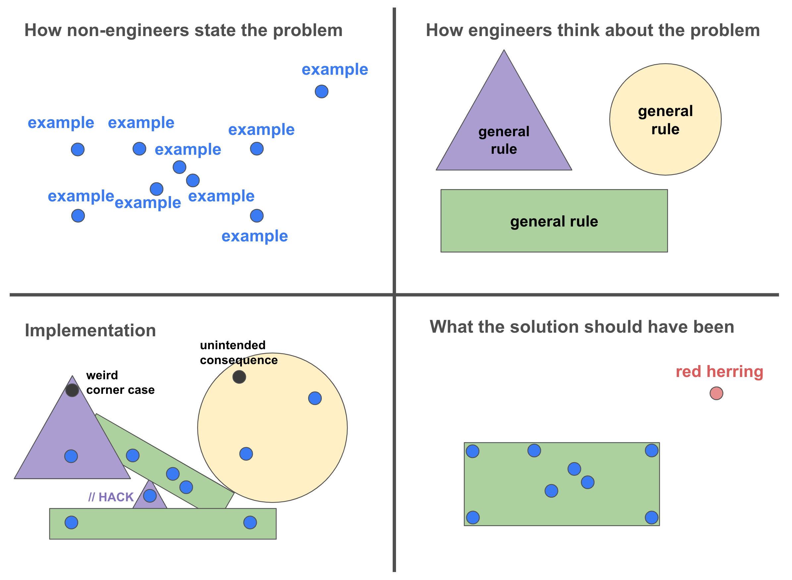

Here is the weekly update of (significant) changes made in Xiphium this week, extracted from Git(Hub).

:::warning
These are interpretations of code read from the weekly changes from Git(Hub) and are therefore prone to errors.
:::

<!--truncate-->
:::note
Many changes were made this week. Therefore, only the project method changes will be reviewed here.
:::

---
## Compiler
For some reason, the compiler in 4D v20.1 LTS project mode catches more errors than in production (v19.1 LTS binary interpreted). These errors are mostly `:` instead of `;` (for separating variables in the declaration) or a useless `;` at the end of a line, for example:
```4D
C_LONGINT(vInteger1:vInteger2)
```
```4D
C_BOOLEAN($bool);
```

This has been going on for a while, but from this week on I will correct these syntax errors.

## Financial
Detail tab added to Ledger Group called 'Ledger Month' in access method ***Access_SetupLedgerMenu***
Detail tab added to Ledger Year called 'Month MC' in access method ***Access_SetupLedgerMenu***

Several 'Clear' methods related to financial tables have been modified (methods used to clear variables used for querying).

Method ***FinLGT_UpdateRecord*** has been modified. The queries for calculating totals from [FinLeG_Total] have been optimized. The results should be the same, but the code is now better readable and possibly even faster in execution time.

Method ***FinLeM_UpdateRecord*** has been modified to to store the intercompany boolean from its related [Ledger_total]. 
:::note
Why does the [Ledger_Month] need to copy a boolean from a record it is already related to?!
:::

:::tip
When a new parameter is used for a query, instead of querying the entitySelection, add the new parameter to the existing query. This will reduce execution time because there will be less server/client communication necessary. Also, hardcoded values could/should be inside the query string for extra clarity (except for dates!).

So instead of:
```4D
$FinLeM:=ds.FinLed_Month.query("FinLeM_LedgerCode = :1 and FinLeM_Month = :2 and FinLeM_ComCode_MC = :3"; [FinLed_Month]FinLeM_LedgerCode; [FinLed_Month]FinLeM_Month; [FinLed_Month]FinLeM_ComCode)
$FinLeM:=$FinLeM.query("FinLeM_InterCompany = :1"; False)
```

Do:
```4D
$FinLeM:=ds.FinLed_Month.query("FinLeM_LedgerCode = :1 and FinLeM_Month = :2 and FinLeM_ComCode_MC = :3 and FinLeM_InterCompany = False"; [FinLed_Month]FinLeM_LedgerCode; [FinLed_Month]FinLeM_Month; [FinLed_Month]FinLeM_ComCode)
```
:::

Method ***FinLeT_UpdateRecord*** has been modified. It seems like a minor optimization in execution speed by commenting out duplicate operations.

Method ***FinLeY_UpdateRecord*** now copies the intercompany boolean from its related ledger total.
:::note
Why does the [Ledger_Year] need to copy a boolean from a record it is already related to?!
:::

## Order
Method ***Ord_CreateRecord_ComCrop*** has been renamed to Ord_Create_ComCrop and the code is also copied to Ord_Create_ComCrop_x.

Method ***Ord_CreateRecord_Prices*** has been renamed to ***Ord_Create_Prices***

## Plant Total
***Clear_PlantT*** has been extended with 20 more variables.

Method ***PlantT_UpdateRecord*** has been modified. The method now calculates 'Plants Present' and 'Order' amounts for location 1 through 6 (all in seperate fields). There is now also the 'multiloc' field that shows in how many locations there are plants ordered (with a threshold of 1.000 plants minimum).

## Project2_Year
Method ***Pro2Y_UpdateRecord*** has been modified. The 'Budget Order' is now correctly calculated, dividing delivery orders and non delivery orders properly (before, the division was between delivery orders and all orders).

## Experiments
Method ***Scanning_ClosePrinting*** has 1 new line added:
```4D
REDUCE SELECTION([Exp_Treatment]; 0)
```
This code snippet is inside a for loop, and is trying to fix a bug where only 1 out of n treatments is made in the classic Experiment scan menu.

## Access
Methods ***Tab_GetFirstAccessibleTab*** and ***Tab_GotoPage*** have been added.

## Web stuff
Method ***Compiler_WebApp*** has been removed, and the code has been implemented in ***Compiler_Methods*** and ***Compiler_Variables***.

Constant 'Xiphium Location Settings App ID' has been added.

Several optimizations and changes done to several methods (too much to summarize here).

Method ***Web_LocSettingsController*** has been added.

## Meme of the week


*Meme of the week is NOT a recurrent theme and is only instantiated whenever I feel like it.*