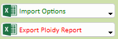
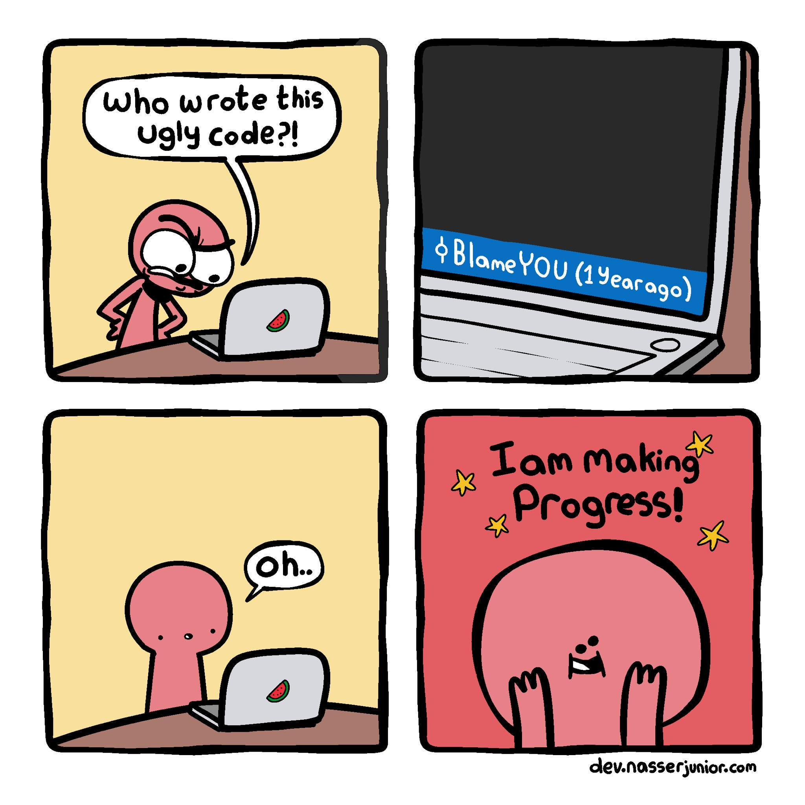

Here is the weekly update of (significant) changes made in Xiphium this week, extracted from Git(Hub).

:::tip
Enjoy the holidays and a happy new year!
:::

:::warning
These are interpretations of code read from the weekly changes from Git(Hub) and are therefore prone to errors.
:::

<!--truncate-->
## Project Mode
In the next year we are planning to switch to 4D Project Mode. The switch to project mode will be a big one, mostly because we will change our workflow to local development with Git(Hub). Using the git client [Tower](https://www.git-tower.com) can help you learn Git faster and makes using it easier. Make sure to checkout their instruction videos [here](https://www.youtube.com/playlist?list=PLyCj4RCToz5BEcpZgwLfAhzxVRlDY3z-O). Download the client (1 month free trial) and try it out yourself!


*more information on project mode and git will follow via email*

### Highlight Buttons
(Almost) all higlight buttons have been replaced with either an invisible button or a 3D button. This is to facilitate the conversion to Project Mode, where Highlight buttons are no longer supported.

## Analysis Order
Form [Analysis_Order]/AnO_Detail has a test with 2 new buttons. These 2 buttons have a dropdown menu to combine multiple buttons into 1. This is a test that will get feedback in the new year. This is an alternative way to the regular dropdown button to combine multiple buttons into 1 button. This cleans up the user interface a lot, and can still have help text if needed.



Method ***AnPlate_ExportFCM_AnPla_Layout*** has been modified. A simple header text change was requested. The method has been updated with the new `#DECLARE` and `Var` syntax.

## Greenhouse Field
A (regular) dropdown button is implemented to replace all the separate 'print label' buttons. The previous 'print label' dropdown menu is moved down to be deleted later (if no one misses this button). The individual 'print label' buttons are still present for now, but will be moved down after the holidays as well.

## ComProdWeek
Method ***ComProdW_Sync_ExportXML*** now also includes Brasil (comcode: 006).

Method ***ComProdW_UpdateRecord_TCPA*** now has an exception case for Brasil. The worktype is not used as a filter for comcode 006.

```4D
If (Settings_GetDefaultCompany="006")
	
	$TCPA:=ds.TC_Plan_Action.query("TCPA_Week_Real = :1 and TCPA_ComCode_Prod = :2 and TCPA_Status # Delete@"\
		; $ComProdW->ComProdW_Week\
		; $ComProdW->ComProdW_ComCode)
	
	
Else 
	$TCPA:=ds.TC_Plan_Action.query("TCPA_Week_Real = :1 and TCPA_ComCode_Prod = :2 and TCPA_Work_Type = :3 and TCPA_Status # Delete@"\
		; $ComProdW->ComProdW_Week\
		; $ComProdW->ComProdW_ComCode\
		; $ComProdW->ComProdW_WorkType)
End if 
```

## Order
Method ***Ord_UpdateRecord*** now has added calculations to calculate the number of stage 2, 3, and 4 plants (both prognose and regular amount) as well as a calculation for the week rooting. This is for the new type of Orders that go from Stage3 to Stage 5 in 1 go (instead of being split up to an order from Stage3 to Stage4 and a repotting Order).

## Web stuff
Method ***Web_TCStockCheckGetStock*** has been modified to include extra information on both the TC_Reg_Emp record, and mostly extra related TCPA information. This information can then be displayed in the app to give more context to the user when a jar is scanned.

## Meme of the week

*Meme of the week is NOT a recurrent theme and is only instantiated whenever I feel like it.*