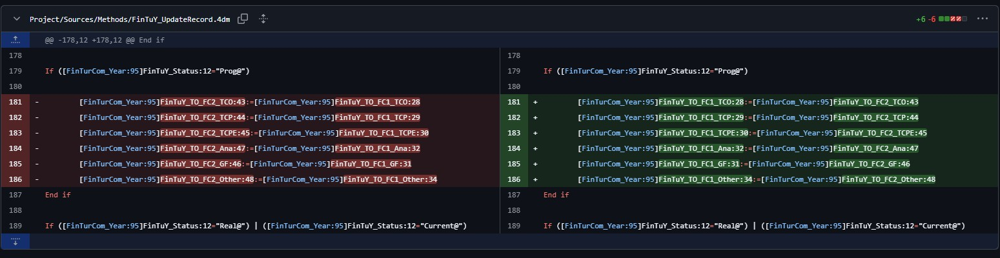

Here is the weekly update of (significant) changes made in Xiphium this week, extracted from Git(Hub).

:::warning
These are interpretations of code read from the weekly changes from Git(Hub) and are therefore prone to errors.
:::

<!--truncate-->

## Breeders Rights
Method ***BreRig_UpdateRecord*** now also copies the CropName from the Tax_Genus table.

:::note Why no Relations?
Why not use relations instead of querying and copying data? Breeders Right could link up to Tax_Genus, that in turn can be connected to Crop. That way, we don't need as many fields in Breeders rights and we reduce our data duplication.
:::

## Purchase Local
Changes were made to the Local Purchase Tables, Forms and Methods. However, someone who knows what is needed for these tables needs to take a look and actually make the details/workflow for these tables work before they can be used.
## FinTurCom_Year
It seems that method ***FinTuY_UpdateRecord*** had a mistake solved where Forecast1 and Forecast2 were swapped.

## PlantMonth
Also method ***PlantM_UpdateRecord*** has its forecast1 and forecast2 swapped
## Analytical Lab
Method ***AnSam_Import_Pathogen_Request*** did not trigger the AnSo_UpdateRecord method. Failing to create Pathogens_to_Test links. This should now be fixed and importing should go without needing to do manual steps afterwards.

## Web
There has been quite some work done on several Order Score methods.