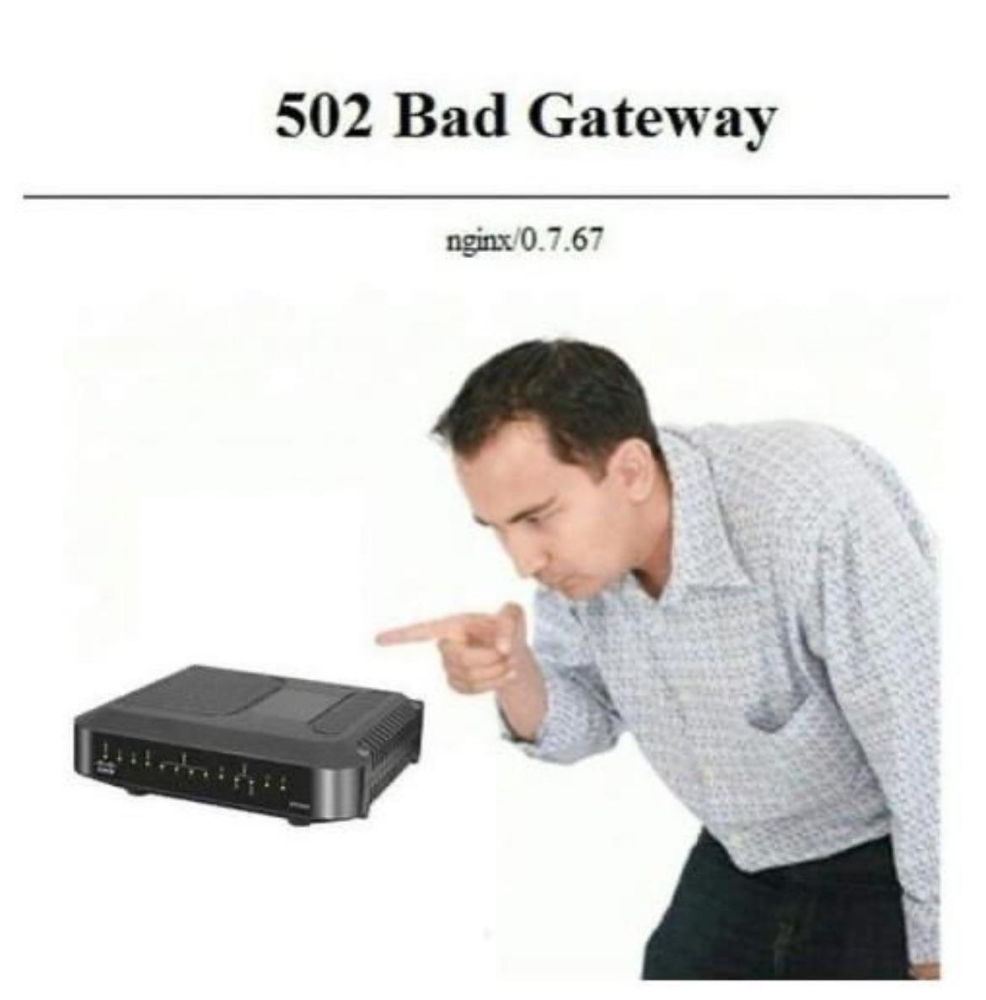

Here is the weekly update of (significant) changes made in Xiphium this week, extracted from Git(Hub).

:::warning
These are interpretations of code read from the weekly changes from Git(Hub) and are therefore prone to errors.
:::

:::info
A total of 297 files were changed. This makes it more difficult to find significant changes to discuss here.
:::

<!--truncate-->
## Access
Method ***Acccess_CheckUserPrivilege*** has been added. The function returns a boolean for if a user has access to a specific function (yes or no).

## Analysis Plate
Method ***AnPlate_UpdateRecord*** is updated status 'reported' is added to 'automatically' detect when all related analysis orders are reported (automatic is in quotes because for now, you still have to 'update record').
## Analysis Isolation Plate
A complaint about how slow the analysis plate layout has become lead to some optimization attempts. An obvious fix is to make sure all relations are indexed (this helped, but not enough). The next step was to cache the relational data into a collection before looping through it. This however, is not optimized at all, it does reduce it to a single server call but this is a very slow and unoptimized server call. The right thing to do here is to define the context beforehand, so every relation in the loop call does not trigger another server call. 

More about the implementation of context next week (it is usually only needed/useful in either a listbox or an ORDA loop with a lot of relational information).

## Deliveries
Method ***DeN_Print_Address_Label*** has 2 print options added:
```4D
SET PRINT OPTION(Paper option; "A4")
SET PRINT OPTION(Orientation option; 2)
```

Form (or button?) **DeN_Print_AddressLabel2** has been modified to only fill in an "Attn: " when there is a contact person entered.
## WBSO & Project2
Method ***Pro2Y_WBSO_Auto_Connect*** has been added. This method makes it more convenient to connect Project2_Years to a ProjectGroup_year by looking at the connection of the previous year. Prerequisite is that the ProjectGroup_Year has to exist in order to connect. All current connections are also overwritten. This method is meant to be used once in the beginning of the year, after WBSO projects have been approved and ProjectGroup_Years have been made (So we should probably move the button somewhere with more restricted access).

Goto button on Project2 is replaced by a button with a dropdown, and the option to go to related project2_years is added.

## TCPA
Method ***TCPA_ExportExcel_Cross_WksSPa2*** has been modified with what seems to be wrong code. The $0 variable is used in a formula (line 354) even though $0 is never declared or used somewhere else....
## Local variable declaration
The amount of undeclared local variables has gone down from 62.698 to about 60.693. This has caused a few errors (some of which could have been caught using the (v20) compiler). But it's a necessary inconvenience to improve the overall robustness of the system and its future development.

Several unnoticed bugs have already been solved by looking at the 'unused local variables' and declaring all of the local variables.

<details>

<summary>Pro's and Cons list for Declaring Variables</summary>
Here is a ChatGTP generated pro's and cons list of Declaring variables:


## 🔸 **Not Declaring Variables in 4D**

### ✅ Pros

1. **Quick and flexible for prototyping**  
    You can write and test logic without worrying about declarations.
    
2. **Less verbose code at first glance**  
    No need to write `var` or `C_*` lines when you just want to try something.

---

### ❌ Cons

1. **No compiler/type checking**  
    Typos silently create new variables (e.g. `myVal` vs `myVla`), and bugs go undetected.
    
2. **No type safety**  
    All undeclared variables behave like implicit `Variant` types — prone to runtime errors.
    
3. **Worse performance**  
    `Variant`-like dynamic typing is slower, especially in loops or intensive logic.
    
4. **No IDE support**  
    No autocompletion, no refactoring tools, no warnings.
    
5. **Harder to read, maintain, and debug**  
    You can’t tell what type a variable is or whether it was intended to exist.
    
6. **Breaks encapsulation**  
    Variables can leak into or be accessed from places they shouldn't (especially with process/global vars).
    

---

## 🔸 **Declaring All Variables (with `var`, `#DECLARE`, or legacy `C_*`)**

### ✅ Pros

1. **Clear, explicit code**  
    It’s obvious what variables are in scope, and what types they are.
    
2. **Compiler catches mistakes**  
    Typos, type mismatches, and undeclared usage can be flagged early.
    
3. **IDE support**  
    Full autocompletion, “go to definition”, “rename symbol”, etc., work properly.
    
4. **Better performance**  
    Declared variables are more efficient than implicit `Variant`s, especially in loops.
    
5. **Scales well**  
    Larger codebases and teams benefit from consistent, type-safe code.
    
6. **Still allows flexibility with `Variant`**  
    If dynamic typing is needed (e.g. for legacy calls or polymorphic logic), you can declare variables as `Variant` explicitly:
    
    4d
    
    KopiërenBewerken
    
    `var dynamicResult : Variant`
    

---

### ❌ Cons

1. **Slightly more upfront work**  
    You must declare variables before using them, even for quick scripts.
    
2. **More verbose in small scripts**  
    Adds a few lines in places where brevity might be preferred.
    
3. **Can feel rigid for very dynamic code**  
    If you’re writing logic that manipulates variable names dynamically (rare, but possible), declarations might get in the way.
    

---

### ✅ **Conclusion**

|Approach|Best for...|
|---|---|
|**Not declaring**|Quick tests, legacy scripts, small one-offs|
|**Declaring all**|Modern development, long-term maintenance, team projects|

Declaring variables is the **recommended modern practice in 4D**, especially with project mode and `var`/`#DECLARE` support. You get all the clarity, safety, and performance benefits — _with_ the option to use `Variant` where needed.

</details>

## Web stuff
Method ***Web_LocationsController*** has been modified to accept the actions 'login', 'media-storage' and 'DELETE', extending the capabilities of the app.
Methods ***Web_MediaStorageDelete*** and ***Web_MediaStorageGetUser*** have been added to facilitate these new funcitonalities.

Method ***Web_MediaStorageSaveDetails*** has been modified (the intent is hard to read from the github diff).
## Meme of the week
_Meme of the week is NOT a recurrent theme and is only instantiated whenever I feel like it._