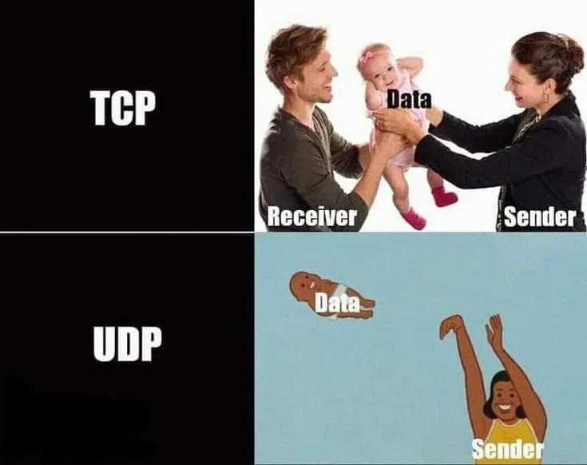

Here is the weekly update of (significant) changes made in Xiphium this week, extracted from Git(Hub).

:::warning
These are interpretations of code read from the weekly changes from Git(Hub) and are therefore prone to errors.
:::

:::info
A total of 452 files were changed. This makes it more difficult/time consuming to find significant changes to discuss here.
:::
<!--truncate-->

## Catalog Changes
All fields of FinTur_ComCrop_Tot are renamed from 'FinTurCCT_' to 'FinT_CCT'. This has affected many forms and methods (and even a Power BI report!).

## FinTur_ComCrop
Besides the name change, some work has been done on several methods like updaterecord and colorfield methods as well as changes to forms.

## ProjectGroup_Year (WBSO)
Method ***ProGY_UpdateRecord_Val*** has been modified to now search for hours in hourregistration using teamcode (on top of WBSO code). Team 20 is for Analytical lab WBSO projects (comcode 012) and the rest is for Iribov WBSO projects.

## Analysis Sample
Export method ***AnSam_ExportExcel_Flex*** is modified to now export the 'Pathogens Tested'.

## Analysis Oligo
A CSV import of ordered oligo's was adjusted. The method assumed that 'date received' would always be empty when importing the CSV, but it seems that the oligo sometimes arrive a day or 2 before the rest of the Order, and the CSV is only sent when the full Order is fulfilled.

## Compiler errors all variables typed
We are currently at 56.212 compiler errors when set to 'all variables are typed'. At this rate, the errors should be resolved around January 2026 (assuming 1800 errors are resolved each week). In other words: This will take a while.

## TCBP
Some TCBP methods have been modified/extended.

## Meme of the week

_Meme of the week is NOT a recurrent theme and is only instantiated whenever I feel like it._