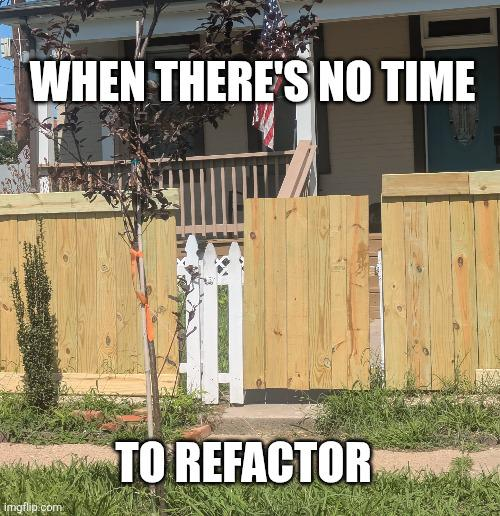

Here is the weekly update of (significant) changes made in Xiphium this week, extracted from Git(Hub).

:::warning
These are interpretations of code read from the weekly changes from Git(Hub) and are therefore prone to errors.
:::

:::info
A total of 67 files were modified. Most of which are to update variable declaration.
:::

<!--truncate-->
## Order
Method ***Ord_ExportExcel_Flex*** is expanded with an extra (optional) column called 'List price assignment'.

## Plant prices
Color method ***PlaPri_ColorField*** now sets status 'Cur@' to green instead of status 'Act@'.

Method ***PlaPri_UpdateRecord*** now sets status to 'Current' instead of 'Active'.

Filter button method in form 'PlaPri_List' object 'OrG_Btn_Filter' was modified. All of the `QUERY` statements (ending with a `*`) were replaced with a `QUERY SELECTION` statement, and the method now starts with an `ALL RECORDS` function. I can see why a change was necessary, because this code would not function as desired but the change made is sub-optimal for performance.

:::danger reduce server calls
using `QUERY SELECTION` will result in a server call **EVERY TIME** it is used. And even worse, starting the filter with `ALL RECORDS` means it has to fetch all of the records from the server, even though you are going to filter it later anyway.

Using many `QUERY` statement (using the `&` and the `*` properties) is a more optimized way, reducing everything to just 1 server call that returns only the records you have asked for. By converting to ORDA you can optimize even more by putting the `ORDER BY` function into the query call, going from 2 server calls to just 1!

This change might not be as noticeable when using Xipihum on LAN (on premise), but it will make a **HUGE** difference on WAN (like when working from home).
:::

## TCPA
Method ***TCPA_SyncExportClones*** is expanded to include an if statement for company 006 (Brazil). It seems like it want to exclude certain clone fields when it's exporting to Brazil. 

Fields to exclude:
 - [Clone]Clo_DeliveryNote
 - [Clone]Clo_Origin_Clone
 - [Clone]Clo_OriginType
 - [Clone]Clo_Origin_Plant_Type
 - [Clone]Clo_CloneType

The import method ***TCPA_SyncImportClones*** keeps the Old value of these excluded fields (so they never actually hcange from this import).
## TCB
Methods ***TCBP_ActionEventHandler*** and ***TCBP_AreaEventHandler*** are added. Methods ***TCBP_DrawActions*** and ***TCBP_SetupLayers*** are modified.

## Greenhouse planning
Small bug in Greenhouse Protocol line creation fixed (variables were getting checked without having a value).

Wrong field name in a complex ORDA filter button expression resulted in a blocking progress bar (a 4D restart was needed to resolve). Typing the correct field name makes it work as expected.
## Meme of the week

_Meme of the week is NOT a recurrent theme and is only instantiated whenever I feel like it._