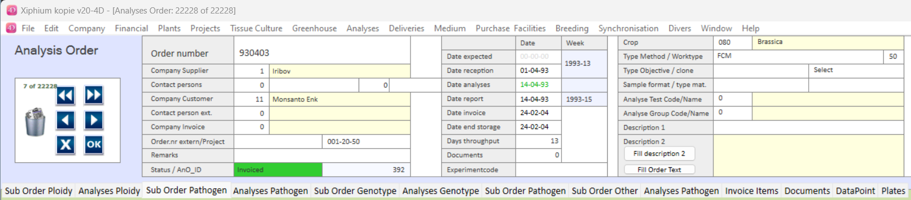

Analysis_Order table contains orders for analysis. This includes orders for Iribov Analytical services (Analytical Lab) as well as outgoing analysis orders to NAK-tuinbouw (and others). The aim for Analysis_Order is to contain information about Who wants to Analyse with What aim and When.

An Analysis Order contains general information about the order: 

- Supplier: Who is going to perform the analysis? 
- Customer: Who is the client 
- Crop: What crop will be sent (this will move to [Analysis_SubOrder](Analysis_SubOrder.md) in due time) 
- Dates
- Method
- Project2 Code

#### Dates
- Arrival 
- Sampling 
- Analysis 
- Reporting
- Invoicing 

#### Method
The technology or '**method**' used for analysis of this Order
- FCM (Flow Cytometry)
- PCR (Polymarase chain reaction)
- PCR-Marker (sub-group of PCR but specifically for markers)
- Phenotype
- Quarantaine
- Elite TPO
- Plating
- ELISA (enzyme linked immunosorbent assay)

#### Objective
The **Objective** of the Analysis (should be linked to a 'method'). The **Objective** will move to [Analysis_SubOrder](Analysis_SubOrder.md) in due time.  
What kind of result is expected from this analysis? where the common ones are:
- Ploidy
- Aneuploidy
- Pathogen (detection of pathogens)
- Genotyping
- etc.
There are many more variations entered in the system. These variations should be analyzed and brought back to a few well thought out categories.
# Tabs
When opening an Analysis Order, different tabs are dynamically shown depending on the type of Method used.

:::info
The screenshot shows all tabs of Analysis_Order detail however, only a select amount of tabs are shown depending on the Analysis_Order Type and your account's access.
:::

---

## Analysis_SubOrder
The [Analysis_SubOrder](Analysis_SubOrder.md) tab can differ depending on the Method set in the Analysis Order. It is meant that the suborder shown only shows fields related to the method, and hides the unrelevant ones. This should help the user in getting a clear overview.

### Sub Order Ploidy
*shown when Order Method = FCM*  
Shows suborder with fields related to ploidy and aneuploidy
### Sub Order Pathogen
*shown when Order Objective = Pathogen*  
Shows suborder with fields related to PCR Pathogen detection
### Sub Order Genotype
*shown when order method = PCR_Marker*  
Shows suborder with fields related to PCR Pathogen detection
### Sub Order Other
*shown when all above does not apply*  
Shows a general suborder subform with many fields...

---

## Analysis_Sample
The [Analysis_Sample](Analysis_Sample.md) tab can differ depending on the Method set in the Analysis Order. It is meant that the suborder shown only shows fields related to the method, and hides the unrelevant ones. This should help the user in getting a clear overview.
### Analyses Ploidy
Show Analysis sample subform with fields related to FCM data (ploidy and aneuploidy)
### Analyses Pathogen
Shows analysis sample subform with fields related to PCR Pathogen detection
### Analyses Genotype
Shows analysis sample subform with fields related to genotyping
### Analyses Other
Shows a general analysis sample subform with many fields...

---

## Invoice Items
The 'Invoicing tab is used for an overview related to invoices.
## Documents
Show the documents related to the Analysis Order. This should include all communication with the client regarding this Order. We often also include the result files and reports.
## DataPoint
A dynamic listbox overview of [Analysis_Sample](Analysis_Sample.md), [Analysis_Isolation](Analysis_Isolation.md) and [Analysis_DataPoint](Analysis_DataPoint.md)
## Plates
A Dynamic listbox overview of Isolation Plates, Analysis Plates and DataPoints
## Description
The tab 'Description' seems to be made mostly to show the 'Analysis test description' in a bigger field.

