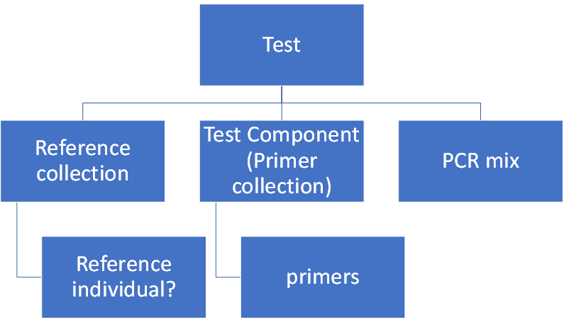

Analysis_Test  is a table that contains information about protocols used in the Analytical Lab. Each record is built from several different modules that together form a protocol/work instruction. 

A proposed structure is shown on the right. This structure is prone to changes! 

The modules are: 
- [Analysis_Test_Component](Analysis_Test_Component)
- [Reference_Collection](Reference_Collection)

