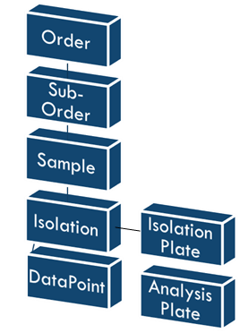

A new structure of dataflow is (being) developed for the analytical lab. The basic structure is depicted below:

- **[Analysis_Order](Analysis_Order.md)**: As seen in the structure, an 'Order' is the highest object in the structure. This is where information about the client, payment information and other relevant information for an Order is stored. Nothing can exist without an Order. An order ALWAYS contains a sub-Order. 
    
- **[Analysis_SubOrder](Analysis_SubOrder.md)**:  A Sub-Order can be used to distinguish different elements of an Order (different crop(s), different tests etc). Amount of Sub-Order is unlimited, but a minimum of 1 
    
- **[Analysis_Sample](Analysis_Sample.md)** should always be part of a Sub-Order. Samples is the place where all analysis data of a sample is displayed 
    
- **[Analysis_Isolation](Analysis_Isolation.md)** is an 'instance' of a sample that is being/been isolated (Nuclei, DNA or RNA isolation). An Isolation can be put into an Isolation_Plate. 
    
-  **[Analysis_Isolation_Plate](Analysis_Isolation_Plate.md)** is used as a 'container' for multiple Isolations. Plate handling data is stored here (who, what, when etc.) 
    
- **[Analysis_DataPoint](Analysis_DataPoint.md)** is the place where individual analysis data is gathered. All (important) details and results should be stored here. A DataPoint can be put in an Analysis_Plate. 
    
- **[Analysis_Plate](Analysis_Plate.md)** is merely a container for DataPoints to be put in. Plate handling data is stored here (who, what, when etc.)

---

Details about practical work/protocols are stored in separate tables. 

- **[Analysis_Test](Analysis_Test.md)**: Table which contains information about a '(pcr) test'. This can be seen as a protocol except the practical steps/instructions are missing. Is related to 'Pathogen' with a N:N relation. 
    
- **[Pathogen](Pathogen.md)**: Table with pathogens which are all given a unique number. Information is mainly their names and type of pathogen. Is related to 'Analysis_Test' with a N:N relation 
- **[Analysis_Oligo](Analysis_Oligo.md)**: Table where all oligo's (primers etc.) infomration is stored. This is mainly about het sequence, storage and which pathogen it detects. Oligo is related to pathogen with a N:1 relation. 
    
- **[Reference_Collection](Reference_Collection.md)**: Table which contains a collection of reference materials. Often material that is used as a positive control in PCR testing (but can be used for more than that). Reference_Collection is related to Pathogen in a N:1 relation (This means that every Reference_Collection record can only be related to 1 pathogen).