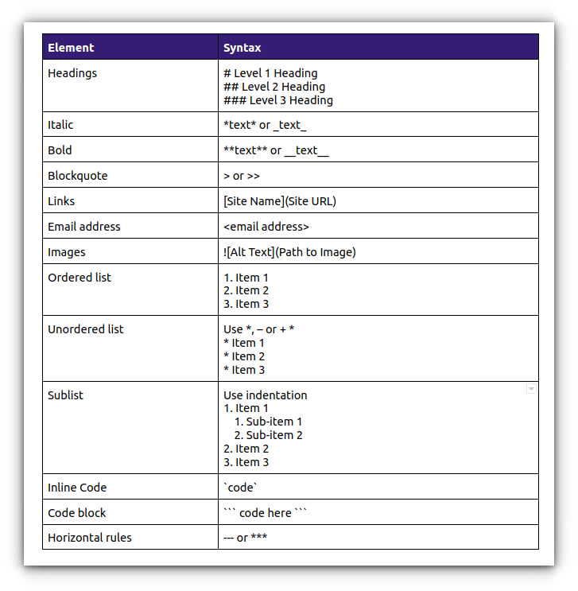

# Markdown Intro


> If you're just here for the documentation and don't want to contribute, skip this page!

A markdown file can be easily created by creating a file with the extension '.md'. This markdown file can be edited by your preferred text editor, but specialized markdown editors with built in renderers are also available. 

### Why markdown?
#### Plain Text
Markdown is plain text, so the written documentation is not locked behind some proprietiery data format. You can always open this file, on any device, with any (plain) text editor.
#### Website
Markdown files can easily be converted to a website with nice styling and formatting. Making the documentation accessible to everyone, all the time. Updates to the documentation can be uploaded and are isntantly visible to everyone.

---

## Markdown Editors
It's possible to use any plain text editor to create and edit markdown files. However, it can be hard to imagine what a markdown file looks like wihtout the formatting applied. Therefore, we can use markdown editors with built in renderers. Here are two popular options:

:::warning 
'Notes' on Mac is **not** a plain text editor!
:::
:::info
'Notepad' on Windows is a plain text editor!
:::


### Obsidian
[Obsidian](https://obsidian.md/) is our recommended markdown editor of choice for it's simplicity and user friendliness. Make sure to go into the settings, 'Files and links' and change the following:
- 'New link format' to 'relative path to file' 
- turn off the 'Use Wikilinks' option. 

Your settings should now look like the following:

:::info
Obsidian uses a slightly different syntax (dialect, if you will) than docusaurus. Changing some settings at least makes the links compatible so all your pictures and links will work correctly. Other things might still work differently in obsidian than in docusaurus!
:::

### Visual Studio Code
[Visual Studio Code](https://code.visualstudio.com/) is recommended for our more tech savy colleagues who might also be interested in using Git(hub) with a user interface. Make sure to install the 'Markdown all in one' extension for a markdown renderer.

---
## Markdown Syntax
Now, writing markdown is not difficult. It's just a little different than Word. Instead of having the formatting options in de UI (clickable buttons), formatting is done using text. Here, I will explain the basics of markdown syntax.

:::note
Feel free to browse on the internet for more information about markdown syntax. But beware that markdown syntaxes can vary, we are using the **Docusaurus Markdown Features** that can be found [**here**](https://docusaurus.io/docs/markdown-features).
:::

For instance, Making text *Italic* is done by surrounding the text by `*` example: `*italic*`.
Making text **bold** is done by surrounding the text by `**` example: `**bold**`.
***Bold and italic*** = `***Bold and Italic***`

This cheat sheet image cal be useful when you start out with writing basic markdown:


Let's give some usefull examples and their markdown syntax:

`*italic*` = *italic*

`**bold**` = **bold**

`***bold+italic***` = ***bold+italic***

---

### Headers
Headers are indicated with a #. more # mean a smaller header.
:::warning
Don't forget to put a whitespace behind the # to create a header.
:::
```
# Header1
## Header2
### Header3
#### etc.
```
# Header1
## Header2
### header3
#### etc.

---

### Ordered list:
```
1. item1
2. item2
3. item3
```
1. item1
2. item2
3. item3
---

--- = line seperator

---

`>blockquote` : 
>blockquote

---
### links (website and document)
`[website name](website url): [Google](https://www.google.com/)` = [Google](https://www.google.com/)

`[document name](relative document path): [intro](intro.md)` = [intro](intro.md)

:::tip
Links can be generated automatically using Obsidian and pasting a url, or dragging a document into the text.
:::


