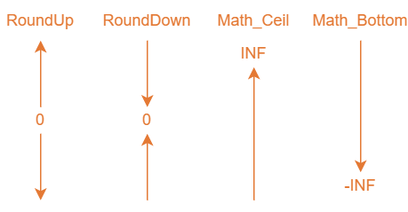

## Round
Rounding reals is a real challenge. 4D has the [Round](https://developer.4d.com/docs/commands/round) command, which rounds number as expected. But sometimes you always have to round up or down to the nearest integer (some things can only be integers, such as the 'amount of plants'). This is where we have introduced 2 different flavors of rounding:
1. Math Floor & Ceiling
2. Round Up & Down

## Math Floor & Ceiling
Method ***Math_Ceil*** rounds the number towards positive infinity.
```4D
$integer:=Math_Ceil(12.3) //results in 13
$integer:=Math_Ceil(-12.3) //results in -12
```

Method ***Math_Floor*** rounds the number towards negative infinity.
```4D
$integer:=Math_Floor(12.7) //results in 12
$integer:=Math_Floor(-12.7) //results in -13
```
## Round Up & Down
Method ***RoundUp*** rounds the number away from 0.
```4D
$integer:=RoundUp(12.3) //results in 13
$integer:=RoundUp(-12.3) //results in -13
```
Method ***RoundDown*** rounds the number towards 0.
```4D
$integer:=RoundDown(12.7) //results in 12
$integer:=RoundDown(-12.7) //results in -12
```
# Difference
The main difference of the 2 methods is how they handle negative numbers (so for positive number only, either is fine). The following illustration might help visualizing the different rounding methods:

