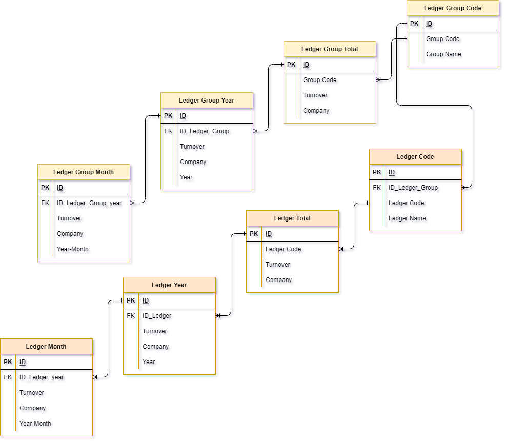

Ledger are used to summarize transactions. Ledgers are recorder per month. Ledgers are part of a ledger Group. A Ledger Group is an aggregation of multiple ledgers.

Ledgers are not connected to the [Invoice](Invoice.md) or [Invoice_Items](Invoice_Items.md) table.

Ledgers and Ledger groups are summarized per Month, Year, and the total.

The full Ledger system consists of 6 tables:
- Ledger Month
- Ledger Year
- Ledger (total)
- Ledger Group Month
- Ledger Group Year
- Ledger Group (total)

Below is the simplified Ledger ERD (Entity Relation Diagram). This ERD contains a lot less fields than in Xiphium, and the table and field names are simplified.
 