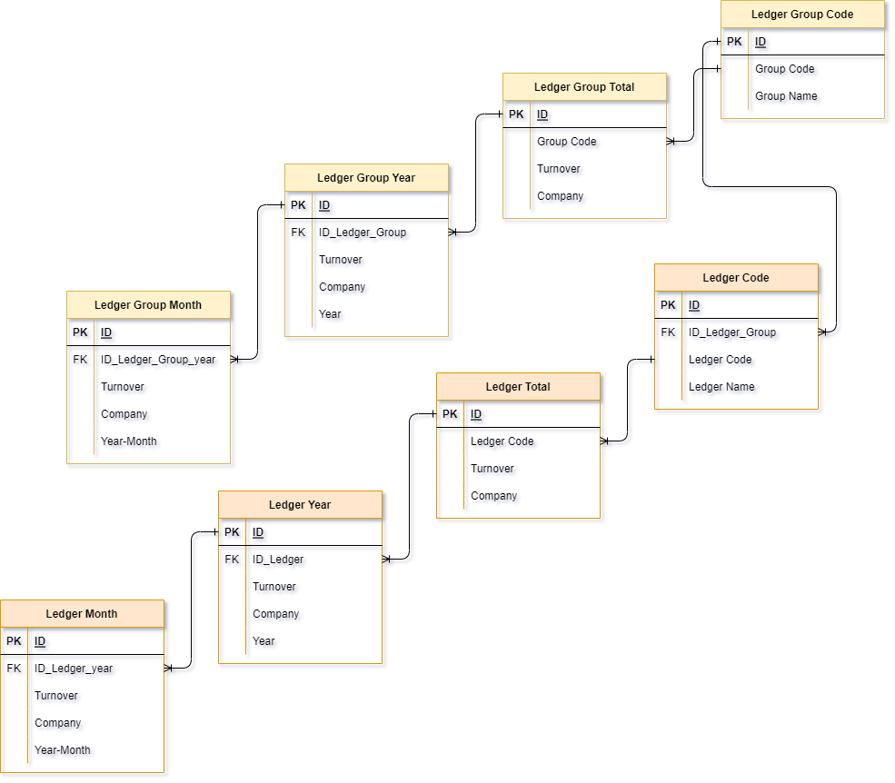

Ledger are used to summarize transactions. Ledgers are recorder per month. Ledgers are part of a ledger Group. A Ledger Group is an aggregation of multiple ledgers.

Ledgers are not connected to the [Invoice](Invoice.md) or [Invoice_Items](Invoice_Items.md) table in this system.

Ledgers and Ledger groups are summarized per Month, Year, and the total.

## Key concepts and workflows
Ledgers are imported from an external financial system called 'King'. Importing these ledgers happens every Month. Ledgers are summarized in time (year and total) as well as groups (Ledger Groups)

## Critical tables and their roles
The full Ledger system consists of 8 tables:
- Ledger Month
- Ledger Year
- Ledger (total)
- Ledger Codes
- Ledger Group Month
- Ledger Group Year
- Ledger Group (total)
- Ledger Group Codes

Below is the simplified Ledger ERD (Entity Relation Diagram). This ERD contains a lot less fields than in Xiphium, and the table and field names are simplified.
 
### Caveat
 A big caveat of this ERD is that the relations displayed here are meant to simplify the intricate relationships of the system. In reality, many of these tables are also related to each other in addition to the relations shown here (for example: Ledger Month is also related to Ledger Group Month).
## Usage Flow
The system imports data from king into the Ledger Month table. This table is then aggregated (manually?) throughout all of the other tables. So, effectively you only really need the Ledger Month table, but the aggregation tables can make it easier to monitor/compare on a higher level. 
## Navigation and Next Tips
At what level do you want to compare Ledgers? Ledger Group per Company per Year? Go to Ledger Group Year. Ledger per Month? Got to Ledger Month, etc. 

### Report
If a deeper analysis of the ledgers needs to be made (to find correlations, make comparisons, etc.) , a report is probably a better option than manually going through these tables.