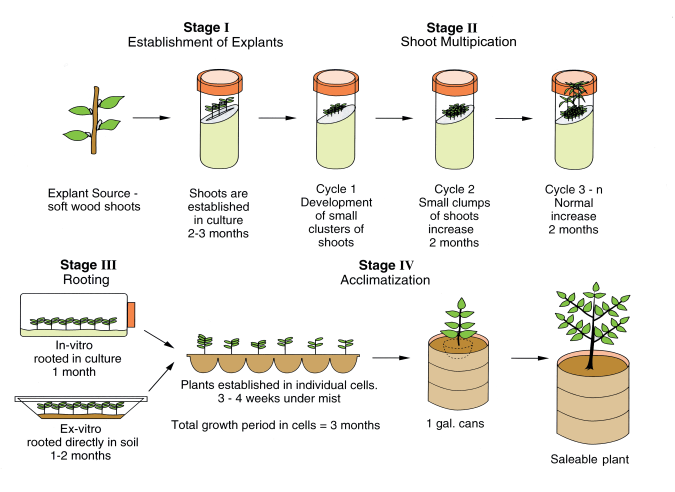

# Stages of Tissue Culture
## Intro
Throughout several tables in Xiphium, there are references to the tissue culture "stage" of plants. These stages are explained [here](https://www.onlinebiologynotes.com/micropropagation-stages-types-applications-and-limitations/), but for documentation purposes, we will also explain them below:

Officially, there are 5 stages of tissue culture:
- Stage 0: Plant Selection
- Stage 1: Initiation
- Stage 2: Multiplication
- Stage 3: Rooting
- Stage 4: Hardening/Acclimatization

At Iribov, we have added an unofficial sixth stage:
- Stage 5: Repotting

*source: rrecenvhort.ifas.ufl.edu*
## Stage 0
Stage 0 is the first step even before tissue culture. This is where you select a suitable plant stock for initiation.

## Stage 1
Stage 1 is the initiation of plant tissue to tissue culture. It's a delicate and intricate process where the tissue has to be sterilized, but not killed. Sterilized tissue is placed in pots with medium to grow shoots that can be used for the next stage: multiplication.

## Stage 2
Stage 2 is the multiplication phase where you let explants grow for a few weeks until they are ready to be cut. The explants are cut at the nodes and all cuttings are put into new pots with medium to grow into new explants that can be cut (this can cycle many times).

## Stage 3
Stage 3 is the rooting phase. Explants are placed in a different kind of medium that stimulates root growth.

## Stage 4
Stage 4 is the hardening phase. After the plants have grown their roots, they can be placed into soil. However, the plants are only used to a warm, high humidity environment with plenty of nutrients readily available. If placed outside in the soil they would collapse and die in no time. To prevent this, the plants are gradually exposed to lower temperatures and humidity in the greenhouse. This 'hardens' the plants, making them ready for harsher environments like 'outside'.

## Stage 5
Stage 5 is our own defined re-potting phase. After the plants are 'hardened' they can be transferred to a pot to fully grow. This is the final phase of a plant where it could even flower Although this phase is not technically part of tissue culture anymore, we do need to include it in our workflow.