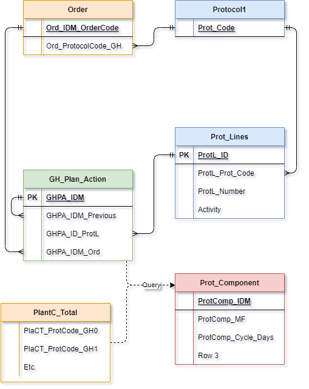

# Automatic Planning (in theory)

The whole road from an [Order], all the way to a Planning is not a simple one. It is partially explained in the ‘Order’ section where it is described how the system goes from an [Order], to a Protocol(1). A Protocol has multiple [Protocol_Lines] (the ‘steps’ of a protocol).

For every [Protocol_Lines], a Planning_Action is made containing:
- **step number** (which step in the protocol),
- **Activity Group**, Activity (optional) and
- **OrderNumber**.

The Entity Relational Diagram (ERD) of the system is shown in Figure below.

## Fill Parameters

Next step is to fill the planning action with parameters from [Protocol_Component], which will actually make the planning actions useful.

To fill the parameters of a planning action, a complex query (search) must be done to account for the possible exceptions. Currently, only a simple query is performed in [Prot_Component] where the CropCode, Activity (or Activity Group) is taken. The matching [Prot_Component] with the lowest Protocol Number is chosen to receive its parameters from. The Protocol Number is saved in the planning action.

## Backwards Calculation

After taking the parameters Multiplication Factor (MF) and Cycle Weeks, we can start creating an actual planning. Taking the prognose week as our final week, we move from the latest planning action (with the highest ‘step number’) to the first planning action. Subtracting weeks and adding the multiplication factor every step of the way.

## Forwards Calculation

When the order contains plants planned for Rooting, Stage 3 Delivery or plants present in the greenhouse, the forwards calculation is performed. The forwards calculation will always overtake the backwards calculation.