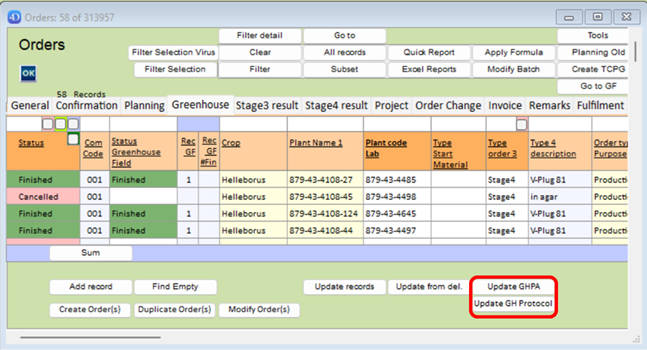

Greenhouse planning is a newly developed (and still in developing) module that takes inspiration from the [Tissue Culture planning](../../Tissue_Culture/Tissue%20Culture%20planning.md) module, but modified and applied to the Greenhouse.

The basic is that a planning can be automatically generated from the [Order](../../Tissue_Culture/Order.md).
:::note
Automatic generation of the greenhouse planning is a general one, and should still be checked and modified if neccessary.
:::

# Structure
The full structure of this greenhouse planning (sub)module is made up from the following tables:
1. [Order](../../Tissue_Culture/Order.md)
2. [Protocol1](Protocol1.md)
3. [Prot_Lines](Prot_Lines.md)
4. [Greenhouse Planning Actions (GHPA)](GHPA.md)
5. [Protocol Component (Prot_Component)](../../Tissue_Culture/Prot_Component.md)
6. Spaces?

:::info
The idea is that spaces will be more integrated in the Greenhouse planning so that a spacial planning can be used.
:::

---
## 1. Order

Everything starts with an [Order]. If ‘Location Delivery 1’ is a company that has the ‘Is Greenhouse’ checkmark in the [Company] table, a greenhouse Protocol can be searched with the ***Ord_Update_GH_Protocol**** Method and is (currently) under the buttons ‘Update GHPA’ and ‘Update GH Protocol’ as shown in figure:

The [Order] automatically finds a ‘GH Protocol’ (Greenhouse Protocol) based on the following parameters:
- Company Code (Delivery location 1). Exact match necessary.
- Order Type 3 (type end material?). Exact match necessary.
- Order Type 5 (Purpose). Exact match necessary.
- Type Start Material. Exact match necessary
- Crop Code. either an exact match, or Crop Code 0 in Protocol when no exact match is found.

- ~~Department Code~~ currently not used for Greenhouse.
- ~~Plant Group~~ currently not used for Greenhouse.
- Priority. Lowest

The found GH Protocol is (currently) shown in the [Order] when opening it and navigating to the  ‘GreenhouseField’ tab, as shown in the figure below.

:::info
[Order] contains information about:
- **What**: PlantCode, Purpose
- **Amount**: Amount of Plants
:::

## 2. Protocol(1)

After an [Order] is connected to a Protocol (by having a protocol code in the ‘GH ProtocolCode Used’ field in [Order]), the connection to [Protocol_Lines] can be used to Create planning actions.

A protocol, in this setting, is a ‘global’ instruction on what to do with a plant. A protocol is comprised of multiple steps (a.k.a. [Protocol Lines](Prot_Lines.md)).

Protocol contains information about:
-          What steps (Activities/Activity groups) are needed.

## 3. Protocol_Lines

[Protocol_Lines] are the individual steps of a protocol. [Protocol_Lines] contain an activity group, and can contain an activity. This activity (group) is used to connect to [Protocol_Component], which contains all the details/parameters of a step.

[Protocol_Lines] contain the information of:
-          What: Activity (Group)

## 4. Protocol_Component

A protocol component is used to set parameters of a certain activity. These parameters are used to calculate and fill several aspects of the planning.

A Protocol Component is searched with the following parameters (of a planning action):
-          Company Code Exact match necessary
-          Crop Code Exact match necessary
-          Activity Exact Match or empty
-          Activity Group Exact match if activity is not defined
-          Lowest protocol Code and highest version number

Protocol Components hold information for:
- What:
    - (Activity)
    - Multiplication Factor (MF)
    - Temperature
    - Plants/Trays per Hour

## 5. Planning actions

Everything explained above comes together in a [planning action](GHPA.md) .

A planning action contains:
- **When**: Year-Week
- **What**: PlantCode, Activity, Other parameters
- **Amount**: Amount of plants
- **Where**: [Future Feature] Location of plant(s)

### Space Calculation
Calculating the amount of space should be a simple calculation:
square meters = (Amount of plants / Plant per tray) * square meters per tray.

However, in the choice list ‘Fust Greenhouse’ only the ‘Plants per Unit’ and ‘Plants per m2’ are entered. So we have to calculate the ‘m2 per tray’ by dividing the ‘Plants per Unit’ by ‘Plants per m2’:

:::warning
This part of the docs is not finished (yet)
:::

### Hours planned

The planned hours are an easy calculation. The ‘Units per Hour’ (UPH) from the planning actions is used and divided by the planned amount of plants to get the planned hours. The UPH can be manually overwritten in the planning action if desired.

Hours Planned = ((Units per Hour * Plants per Unit)/ Amount of plants)

