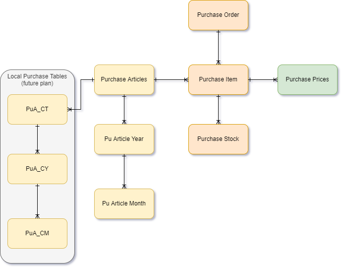

## Structure image
The structure of the Purchase Facilities module is visualized here:

At the middle of the module, is the [Purchase Items](Purchase%20Items.md) table. This is the table that contains the most rows. it combines information of [Purchase Order](Purchase%20Order.md) and [Purchase Articles](Purchase%20Articles.md) and fills the [Purchase Stock](Purchase%20Stock.md)table. Prices are very prone to changes, so they are stores in the [Purchase Prices](Purchase%20Prices.md) table. 

### Aggregation tables

[Purchase Articles Year](Purchase%20Articles%20Year.md) and [Purchase Articles Month](Purchase%20Articles%20Month.md) are summary tables that summarize the [Purchase Items](Purchase%20Items.md) per Year and per Month (respectively).

### Purchase Local

In grey, on the left side of the image, are the new local purchase tables that are planned to be used any time soon. These tables are local versions of [Purchase Articles](Purchase%20Articles.md), [Purchase Articles Year](Purchase%20Articles%20Year.md) and [Purchase Articles Month](Purchase%20Articles%20Month.md) that will be synchronized to NL, and aggregated into  [Purchase Articles](Purchase%20Articles.md), [Purchase Articles Year](Purchase%20Articles%20Year.md) and [Purchase Articles Month](Purchase%20Articles%20Month.md).