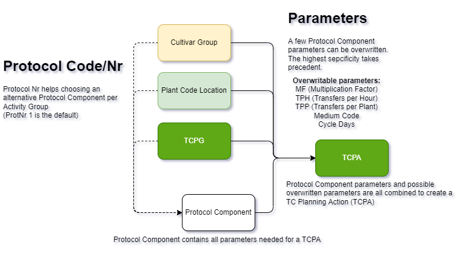

Choosing parameters to use in the Planning actions follows a 'decision tree' with varying specificities. The following tables are used (from low to high specificity):

1. Crop
2. Cultivar (in table PlantCode Loc for now)
3. TC_Plan_Group

The most important parameters can be specifically set here for a specific Activity Group
- Multiplication Factor (MF)
- Cycle Days
- Transfers per Hour/Transfer Rate (TPH)
- Medium Code
- Plants per Unit (PPU, how many plants per container)
- Protocol Number

## Protocol Number
Although protocol number seems like 1 simple parameter, it does a lot more than it seems. This protocol number corresponds with the 'Protocol Code' in the Protocol Components table. Protocol Component has the lowest specificity of all, but it has a lot more parameters (type of container, temperature, light intensity, etc.).

The code (will) search for protocol components with protocol code 1, and a specified alternative protocol code from any of the places you can enter it. The alternative protocol component takes priority, but if it is not present, protocol component with protocol code 1 is taken.

This means, that if you have an activity like CA (multiplication), and need to use a different Protocol Component (protocol code 2) for a specific cultivar, all your other T1 activities will also prioritize the protocol component with protocol code 2! This is by design because the alternative would be having many records in protocol component with a lot of extra fields for Cultivar, PlantCode and TCPG which is impossible to manage properly.

::: info
The decision tree is still in development. Not all functionality described here is (fully) implemented.
:::