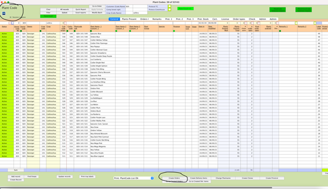
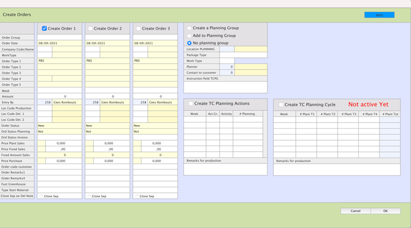

**What is a cert order?** Read the [Cert Order concept page](../../../Company/Order/Cert.md).

---

Create orders vanuit plantcode scherm. Zoek prijs van certificering op in Xiphium

Selecteer de plantcodes waar een certificerings order van gemaakt moet worden.

Druk op button create orders. Er verschijnt pop-up scherm. In dit scherm kan de cert order en de tcpg aangemaakt worden.

VUL VERPLICHTE VELDEN IN:

- Klantcode: Xiphiumcode van company.
- Worktype: 03 (initiatie) of 04 (indien al in ISH, maar niet SEE)
- Ordertype 1: P&S
- Ordertype 2 : certificering
- Week : start week AA + 20 weken bij stage 2 materiaal, AA + 24 weken bij vivo materiaal (inschatting wanneer cert is afgerond)
- Amount: leeg laten.
- Loc Code production: 001 (Iribov)
- Order status: new, indien bevestigd aan de klant, dan aanpassen naar confirmed
- Order status invoice: at reception order
- Price fixed sales: voer hier de prijs in van certificatie. Check met Inge.
- Fixed amount sales: 1. (een opdracht per variëteit.)
- Hiermee de cert order aangemaakt, nu volgt nog TTT order, nodig voor de planten in de kas. Opzet op tray104.

VUL VERPLICHTE VELDEN IN create order 2 (screenschot)
- Klantcode: 001, planten is onderdeel van opdracht, dus op naam van Iribov.
- Worktype: 03 (initiatie) of 04 (indien al in ISH)
- Ordertype 1: P&S
- Ordertype 2 : delivery
- Ordertype 3: stage4
- Ordertype 4: in agar
- Order type 6; tray 104
- Ordertype 5: 35: (cert +TTT)
- Type activiteit: GN
- Amount: aantal planten.
- Week : start week AA + 20 weken (inschatting wanneer cert is afgerond)
- Loc Code production: 001 (Iribov)
- Del loc 1: 005
- Del Loc 2: 005 (wordt niet afgeleverd bij de klant.)
- Order status: new. indien bevestigd aan de klant, dan aanpassen naar confirmed
- Order status invoice: at reception order
- Price fixed sales: geen prijs, is onderdel van certificeringstraject.
- TYPE INVOICE: package (hiermee instructie voor admin dat ‘0’-prijs klopt)
- Planning group (TCPG) : is dezelfde TCPG als bij cert. Order.
- Location PLANNING: 001
- Worktype: 03 of 04
- Planner: Ria.
- Contact to customer: code van acct manager
- Zet in order fixed delivery datum stage 3!! Dit is rond 12 /13 weken voor week request.
- Info gecontroleerd? Druk op 
- Hiermee is certificeringsorder order aangemaakt.